# 深度学习常用激活函数

## 1.线性激活函数

$$f(x)=x$$

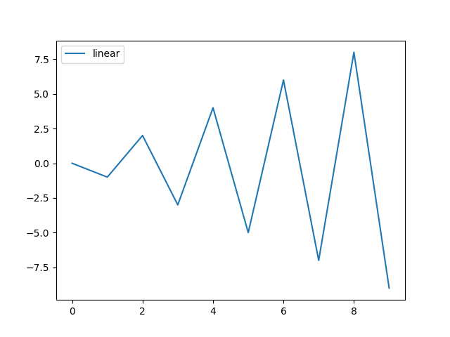

## 2. 自然指数激活函数

$$f(x)=e^{x}$$

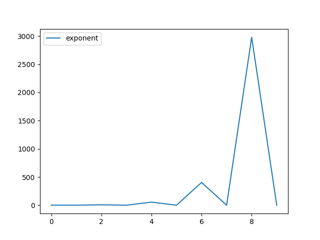

## 3. Sigmoid激活函数

$$f(x)=\frac{1}{1+e^{-x}}$$

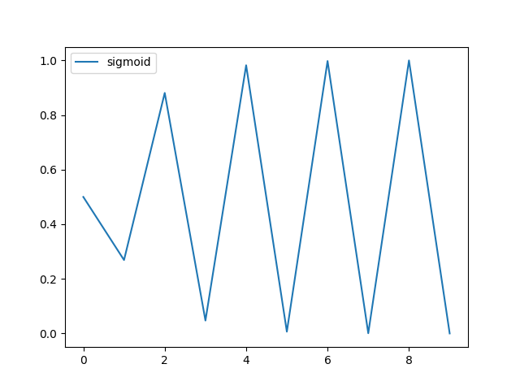

## 4. Hard_sigmoid激活函数

$$f(x)=\left\{\begin{array}{**lr**}0 &x\textless -2.5\\0.2*x+0.5&-2.5 \leq x\leq2.5\\1&x\textgreater 2.5\\ \end{array}\right.$$

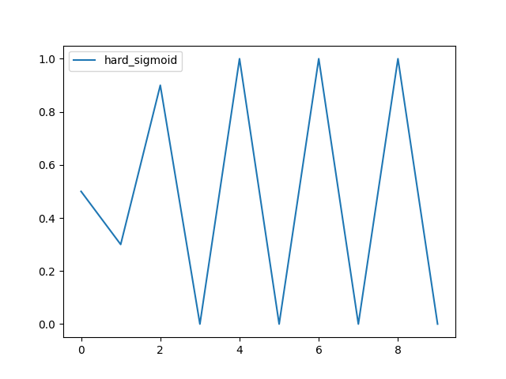

## 5. 双曲正切激活函数

$$f(x)=\tanh(x)=\frac{e^{x}-e^{-x}}{e^{x}+e^{-x}}$$

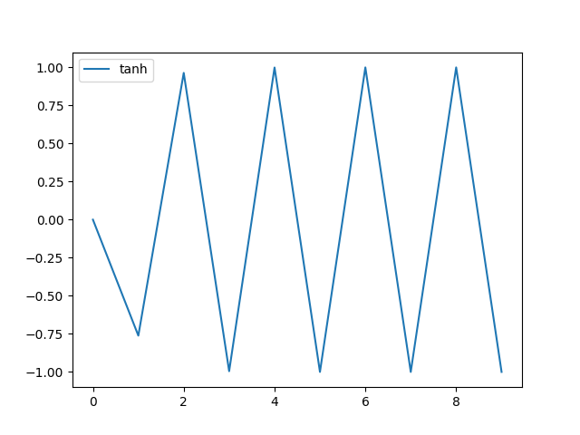

## 6. Softsign激活函数

$$f(x)=softsign(x)=\frac{x}{1+|x|}$$

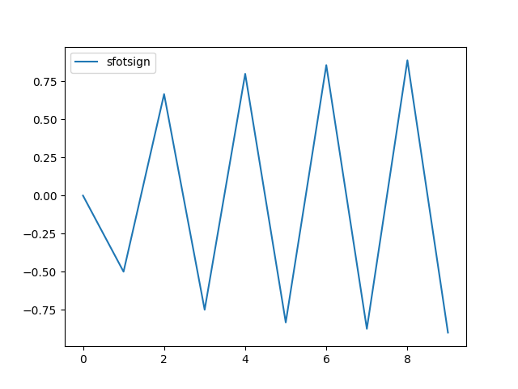

## 7. ReLU激活函数

$$f(x)=relu(x)=\max(0,x)$$

## 8. GeLU激活函数

$$f(x)=x\sigma(1.702x)=0.5x(1+\tanh(\sqrt{2/\pi}(x+0.044715x^{3}))$$

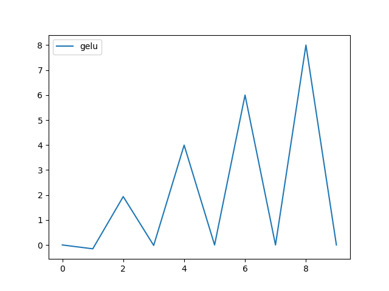

## 9. Softplus激活函数

$$f(x)=softplus(x)=\log(e^{x}+1)$$

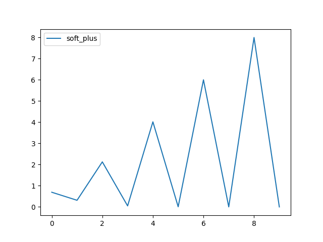

## 10. ThresholdedReLU激活函数

$$f(x)=ThresholdedReLU(x,\theta)=\max(x,\theta)=\left\{\begin{array}{**lr**}0&x\leq \theta\\x&x\textgreater\theta\end{array}\right.$$

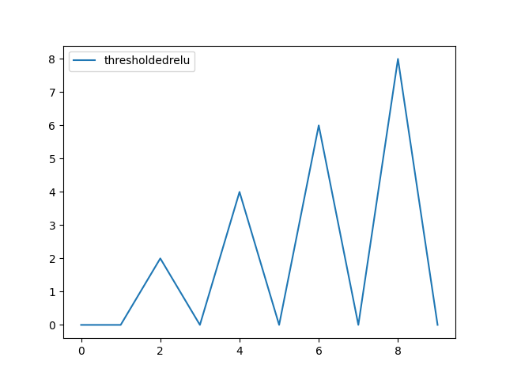

## 11. LeakyReLU激活函数

$$f(x)=LeakyReLU(x,\alpha)=\left\{\begin{array}{**lr**}\alpha*x&x\textless0\\x&0\leq x\end{array}\right.$$

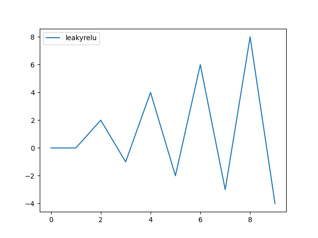

## 12.  ELU激活函数

$$f(x)=elu(x,\alpha)=\left\{\begin{array}{**lr**}\alpha(e^{x}-1)&x\textless0\\x&0\leq x\end{array}\right.$$

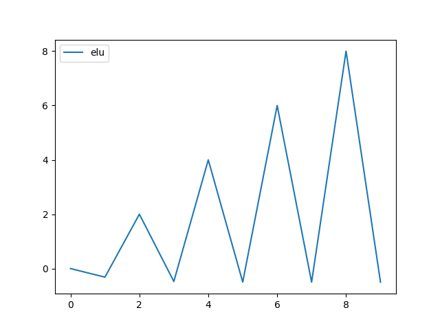

## 13. Softmax激活函数

$$f(x)=softmax(x)=\frac{e^{x_i}}{\sum^{n}\limits_{j=0}e^{x_j}}$$

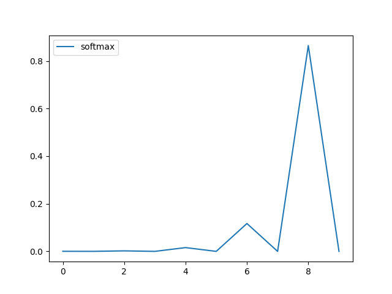

## 14. Swish激活函数

$$f(x)=x*sigmoid(x)$$

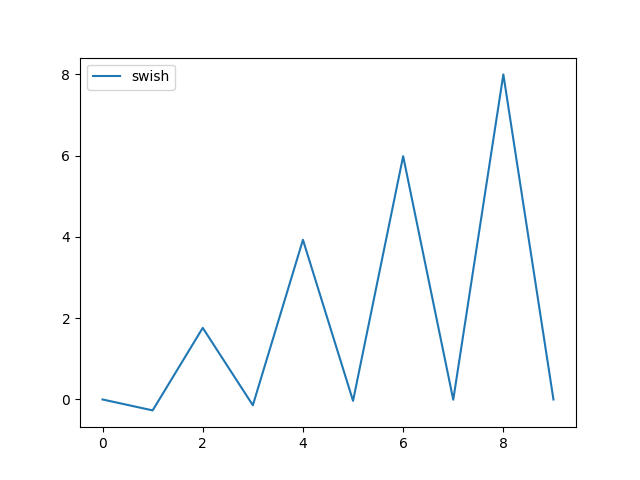