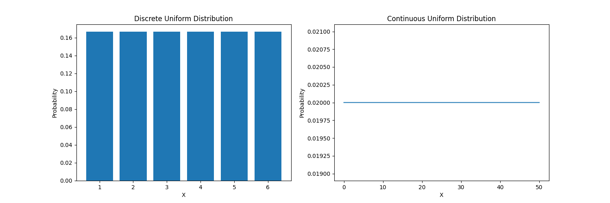
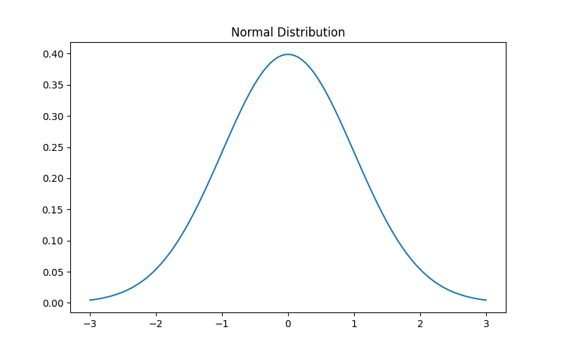
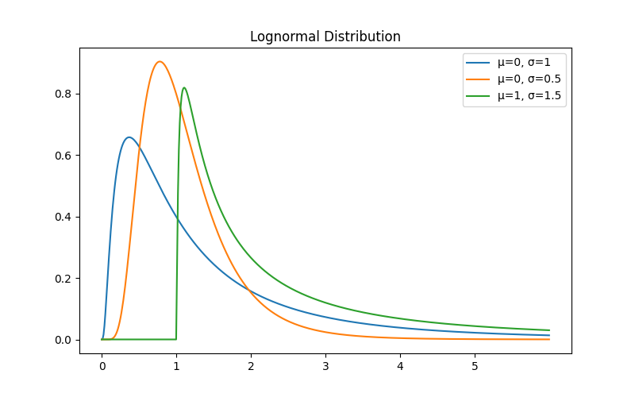
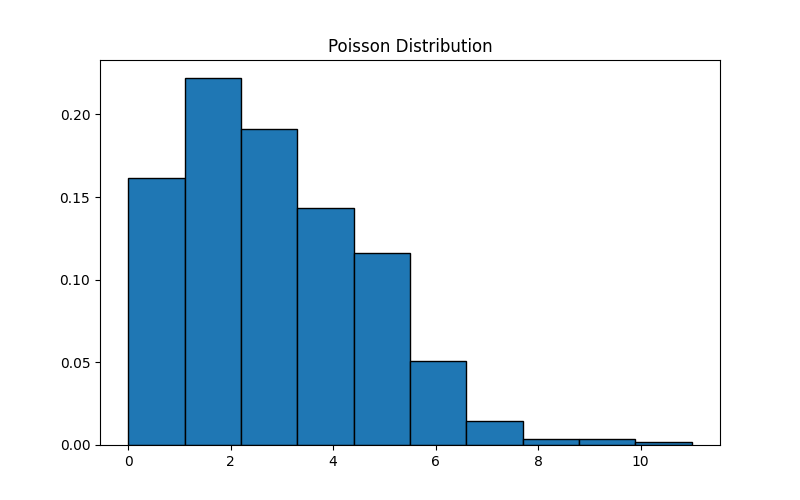
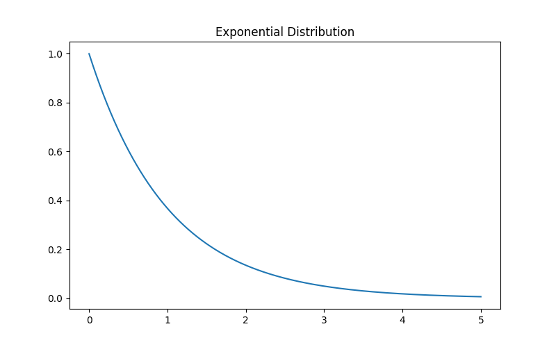
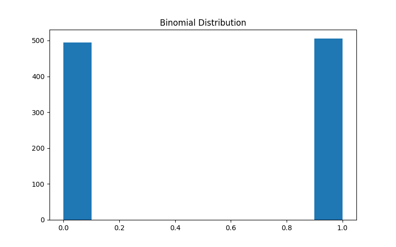
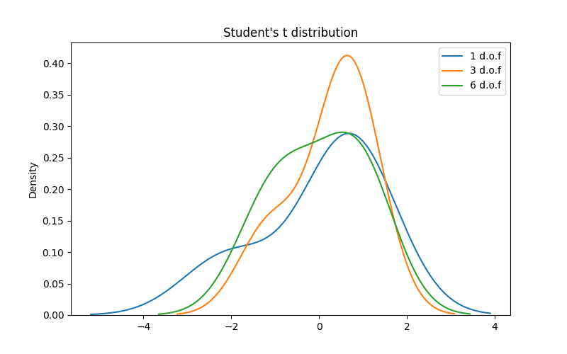
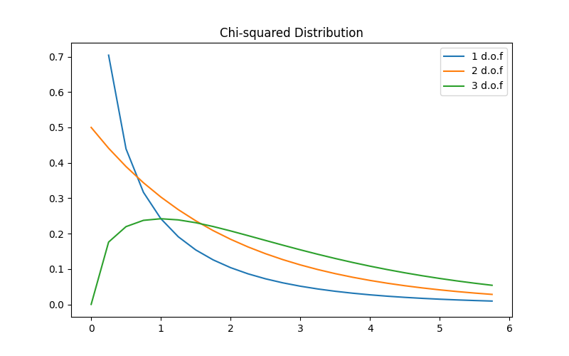

# 常见的几种数据分布及其可视化

## 1. 均匀分布

$$f(x)=\frac{1}{n},离散型$$

$$f(x)=\frac{1}{b-a},连续型$$

## 2. 高斯分布

$$f(x,\mu,\sigma)=\frac{1}{\sigma\sqrt{2\pi}}e^{-\frac{1}{2}(\frac{x-\mu}{\sigma})^{2}},\sigma表示标准差，\mu表示平均值$$

## 3. 对数正态分布

$$f(x,\mu,\sigma)=\frac{1}{x\sigma\sqrt{2\pi}}\exp(-\frac{(\ln(x)-\mu)^{2}}{2{\sigma}^{2}})$$

## 4. 泊松分布

$$f(\lambda,k)=\frac{{\lambda}^{k}e^{-\lambda}}{k!},\lambda是一个时间单位的事件率,k是出现的次数$$

## 5. 指数分布

$$f(x,\lambda)=\left\{\begin{array}{**lr**} \lambda e^{-\lambda x} & 0\leq x\\0&x\textless 0 \end{array}\right.$$

## 6. 二项分布

$$P(x)=C^{x}_{n}p^{x}(1-p)^{n-x}$$

## 7. tao分布

$$f(t,n)=\frac{\Gamma(\frac{n+1}{2})}{\sqrt{n\pi\Gamma(\frac{n}{2})}}(1+\frac{t^{2}}{n})^{-(\frac{n+1}{2})}$$

## 8. 卡方分布

$$f(x,k)=\frac{1}{2^{\frac{k}{2}}\Gamma(\frac{k}{2})}x^{\frac{k}{2}-1}e^{-\frac{x}{2}}$$

